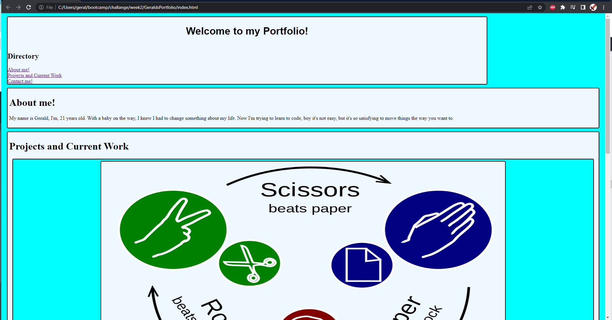

# GeraldsPortfolio

First of all, Im sorry for what it looks like.

Im excited to be working on it more, as we go through the course, I was not able to put in the time I knew I needed to.

This is my Portfolio!

The hyper links take you to the correct locations.
I have the needed headers.
I can't wait for a better week.
Thanks a lot.